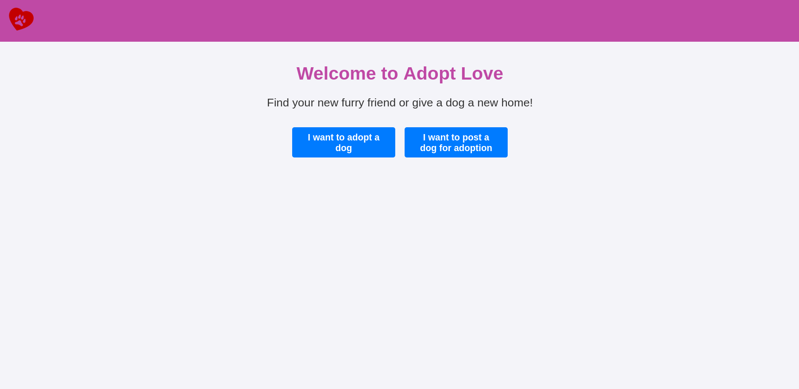
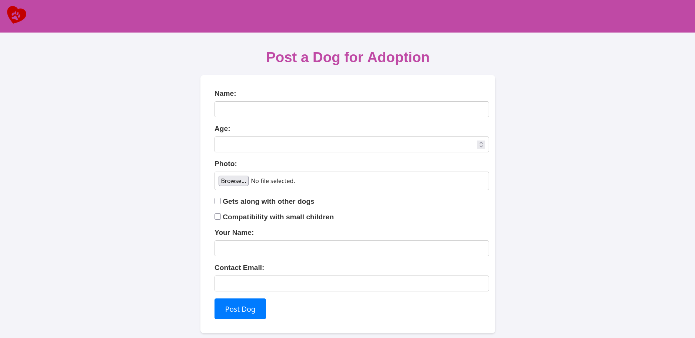
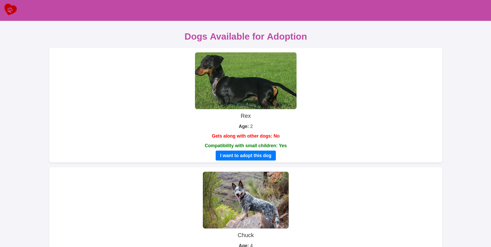
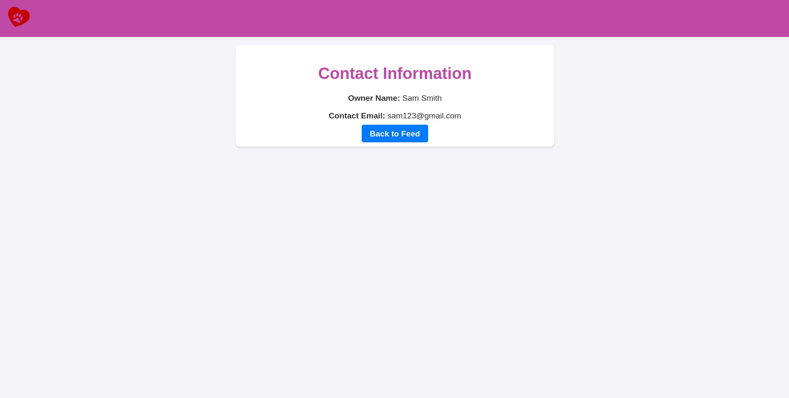

# Adopt Love

#### Video Demo: https://youtu.be/O3sOeetajDY

## Description

Adopt Love is a web application created as my final project for CS50. The main goal of the project is to provide a simple platform where people can post dogs for adoption and where potential adopters can browse the available dogs and contact their owners.

The idea for this project came from a real problem in my community. In the area where I live in Guadalajara, Mexico, there are many stray dogs. I have adopted dogs myself, but I know that not everyone is able to adopt every animal they find. Because of that, I wanted to create a small web application that could help connect people who want to give a dog a home with people who are trying to responsibly find one.

This project was also important to me from a learning perspective. CS50 was my first serious experience with programming, and Adopt Love allowed me to apply several topics from the course in a single project: Python, Flask, SQLite, HTML, CSS, routing, templates, forms, file uploads, and dynamic content rendering.

Although the application is simple, it represents a complete web app with a clear purpose, a database, user input, image handling, and multiple pages connected through Flask routes.

## Objective

The objective of Adopt Love is to make the dog adoption process easier and more accessible by allowing users to:

- Register dogs that are available for adoption.
- Upload a photo of each dog.
- Share useful information about the dog, such as age and compatibility with other dogs or small children.
- Display all registered dogs in a public feed.
- Allow potential adopters to access the owner's contact information.

The project is not intended to be a full professional adoption platform yet, but rather a functional prototype that demonstrates how technology can help organize and share adoption information in a simple way.

## Problem the Project Addresses

In many communities, stray dogs are a common issue. Some people are willing to help but do not always have an organized way to share adoption information. Social media can be useful, but posts can easily get lost, and the information is not always structured.

Adopt Love tries to solve this problem by providing a dedicated place where each dog can have its own adoption post with relevant information and a photo. This makes it easier for someone interested in adopting to browse available dogs and contact the person responsible for the post.

## Features

- Home page with a short introduction to the application.
- Form to post a dog for adoption.
- Image upload for each dog.
- SQLite database to store dog and owner information.
- Feed page that displays all dogs available for adoption.
- Compatibility information, such as whether the dog gets along with other dogs or small children.
- Contact page where users can see the owner’s contact information.
- Simple and clean interface created with HTML and CSS.
- Reusable base template using Jinja2.

## Technologies Used

- Python
- Flask
- SQLite
- HTML
- CSS
- Jinja2

## Project Structure

```text
AdoptLove/
├── assets/
│   └── images/              # Images used in this README
├── static/
│   ├── css/
│   │   └── styles.css       # Main stylesheet
│   └── images/              # Dog images uploaded through the application
├── templates/
│   ├── adopt.html
│   ├── base.html
│   ├── feed.html
│   ├── index.html
│   └── post_dog.html
├── .gitignore
├── app.py                   # Main Flask application
├── dogs.db                  # SQLite database
├── README.md
└── requirements.txt
```

## How the Application Works

Adopt Love is built using Flask. The application starts from `app.py`, where the Flask app is created, the database connection is handled, and the different routes of the website are defined.

The app uses SQLite as its database. The database stores information about each dog posted for adoption, including the dog’s name, age, image, compatibility information, owner’s name, owner’s email, and the date when the post was created.

The frontend is built with HTML templates using Jinja2. A base template, `base.html`, is used to define the general structure of the pages, including the navigation bar and the link to the CSS file. Other pages extend this base template to avoid repeating the same HTML structure.

The CSS file is located in `static/css/styles.css` and is used to style the pages, forms, buttons, images, and general layout of the application.

## Main Pages

### Home Page

The home page introduces the purpose of Adopt Love and gives users a simple starting point. From here, they can choose whether they want to browse the dogs available for adoption or post a new dog for adoption.

This page works as the main entry point of the application and provides a quick overview of what the platform is for.



### Post a Dog Page

The **Post a Dog** page allows users to submit information about a dog that is available for adoption. The form includes fields for the dog’s name, age, photo, owner’s name, owner’s contact email, and compatibility information, such as whether the dog gets along with other dogs or with small children.

When the form is submitted, the data is stored in the SQLite database, and the uploaded image is saved so it can later be displayed in the adoption feed.



### Adoption Feed

The **Adoption Feed** page displays all dogs that have been registered in the application. Each dog appears with its photo, name, age, and compatibility details.

This page is generated dynamically using Jinja2. Instead of writing each dog manually in HTML, the application retrieves the stored records from the database and creates a card for each one automatically.

This section is one of the most important parts of the application because it allows potential adopters to browse all the available dogs in one place.



### Contact Page

When a user is interested in adopting a specific dog, they can open the **Contact Page**. This page displays the owner’s name and email address so that the potential adopter can contact them directly.

This makes the process simple and direct, since the application connects the person interested in adoption with the person responsible for the dog.



## Installation and Usage

To run this project locally, first clone the repository:

```bash
git clone https://github.com/your-username/AdoptLove.git
cd AdoptLove
```

Create and activate a virtual environment:

```bash
python -m venv .venv
source .venv/bin/activate
```

Install the required dependencies:

```bash
pip install -r requirements.txt
```

Run the Flask application:

```bash
flask run
```

Then open the local development server in your browser.

Depending on the configuration, the application may also be run with:

```bash
python app.py
```

## Database

The project uses a SQLite database named `dogs.db`.

The database stores the information submitted through the adoption form. Each record represents a dog available for adoption and includes data such as:

- Dog name
- Dog age
- Dog photo
- Compatibility with other dogs
- Compatibility with small children
- Owner name
- Owner email
- Date of creation

SQLite was chosen because it is simple, lightweight, and useful for small projects or prototypes like this one.

## Design Decisions

I decided to use Flask because it was one of the topics I enjoyed the most during CS50. After working with Flask in the course, I wanted to create a project that expanded on what I had learned and allowed me to build something more personal.

I also chose SQLite because it allowed me to store adoption posts without needing a more complex database system. For this type of project, SQLite was enough to demonstrate how data can be saved, retrieved, and displayed dynamically.

The design of the interface is intentionally simple. Since the main purpose of the project was functionality and learning, I focused first on making the application work correctly. The visual design can be improved in future versions.

## Challenges

One of the main challenges was building a complete project from scratch. Since this was one of my first programming projects, I had to understand how the backend, frontend, database, and templates worked together.

Another challenge was handling user-submitted data and displaying it dynamically. Learning how to connect Flask routes with HTML templates and database queries was an important part of the project.

At the time I originally created this project, I was also still learning how GitHub worked. Because of that, the first version of the README included screenshots of the code instead of focusing on the application itself. This updated README better represents the project and follows a more standard structure for a GitHub repository.

## Future Improvements

Some possible improvements for future versions of Adopt Love include:

- Add user accounts and authentication.
- Allow owners to edit or delete their adoption posts.
- Add a status system to mark dogs as adopted.
- Add search and filtering by age, compatibility, or location.
- Improve the visual design and make the interface more responsive.
- Add validations for uploaded files.
- Add better error handling for missing or incorrect data.
- Add a system to help verify responsible adoption.
- Add follow-up features after adoption.
- Deploy the application online so it can be used by other people.

## Personal Reflection

This project was especially meaningful to me because it combined programming with a real problem that I care about. Building Adopt Love helped me understand how Flask applications are structured, how templates work, how to connect a web application to a database, and how to handle user-submitted information.

It was also a very important learning experience because it showed me that programming can be used to create tools that are connected to real-life situations. Even though the application is simple, it gave me a better understanding of how a full web application works.

Looking back, I can see that the original version of the project documentation was not very standard. I explained too much of the code directly and used screenshots of the source code instead of showing the application running. This updated README presents the project in a clearer and more professional way.

Adopt Love is a simple project, but it was an important step in my learning process and a foundation that could be improved into a more complete adoption platform in the future.

## License

This project is licensed under the MIT License.